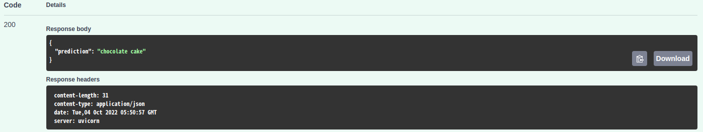

## Dessert Image Classification Server


<h5 align="center">prediction: chocolate cake</h5>

To run the server:
```commandline
python server.py
```

Head to http://localhost:8000/doc, and provide the url to the image for classification
in the `image_link` field. The response will show the dessert name.

